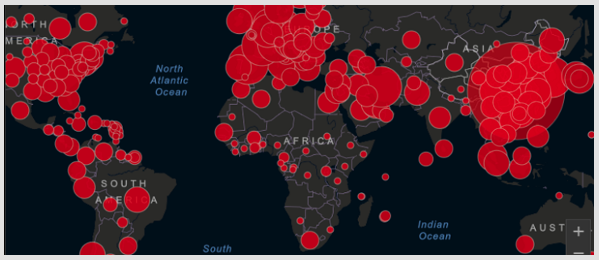
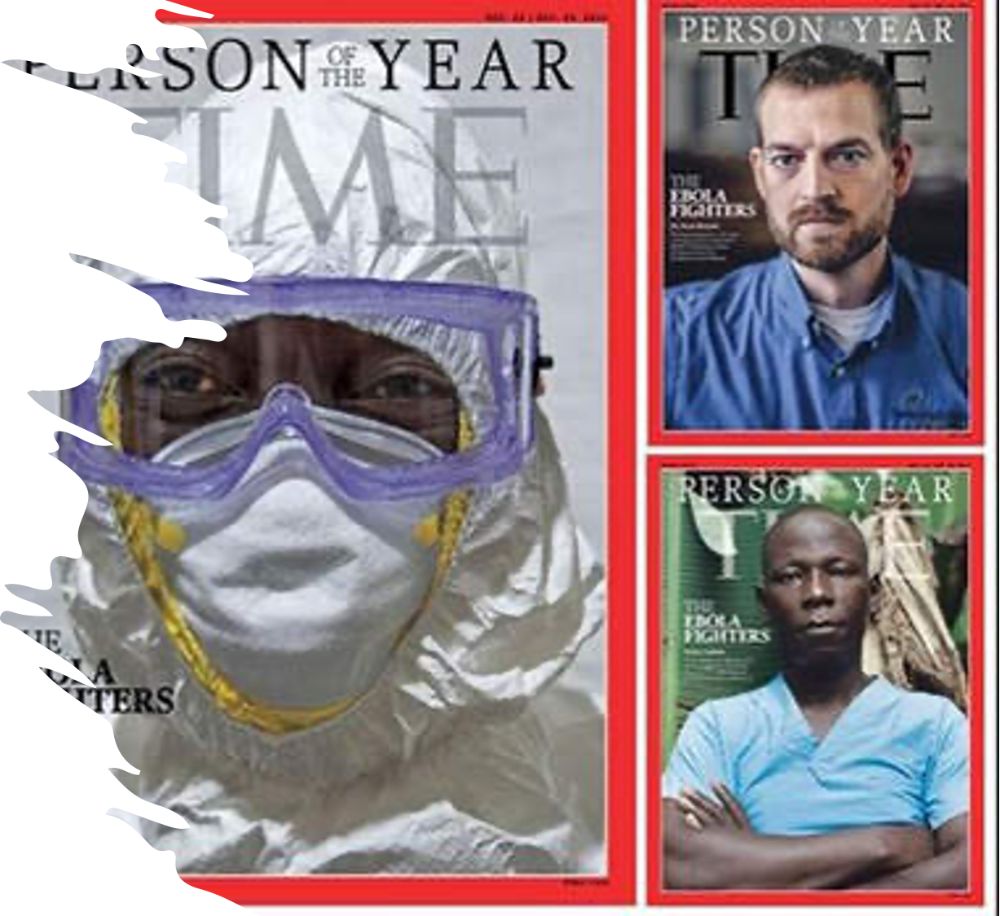

This research project consists of a set of activities finalized to the classification of the prognosis of a patient affected by coronavirus. 

The project is in collaboration with Prof. Salvatore Carta and Dr. Sebastian Podda of the University of Cagliari.

**The Covid-19 disease**

Recent epidemiological data on the spread of the virus indicate an extremely worrying scenario:

• 53 mln people have been infected

• 1,3 mln people have died

The first responses of the medical and scientific community has considered the use of certain drugs, able to slow the decline of symptoms, so as to give breathing space to intensive therapies.

The latter have been the true Achilles heel of health care system(both Italian and international)

Reason: especially in the early stages of the epidemic, even in the presence of mild symptoms, ittended to hospitalize in the ICU all COVID positives. In a short time, the ICUs became saturated and COVID positives with serioous symptoms werewithout adequate care to combat the virus.

Community responses were driven by the need to offer the best of care to all. But experience can be useful to learn from mistakes.

What was missing was a criterion for assessing the severity of the disease on the individual patient. This decision must be taken on the basis of precise data and detailed information.

The data of the patient comprise both the CXR lung image and his/her medical record. The reference database is available [here](https://aiforcovid.radiomica.it) (registration needed).